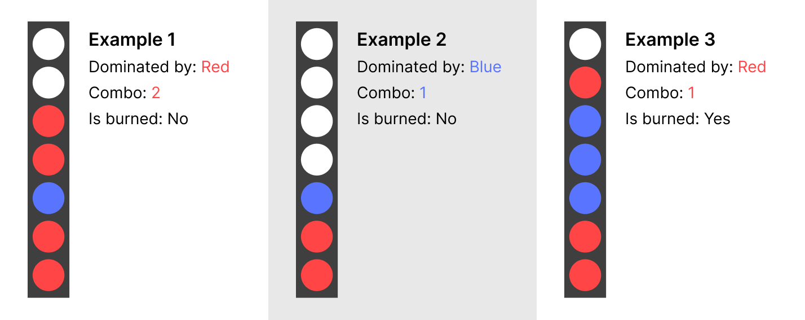
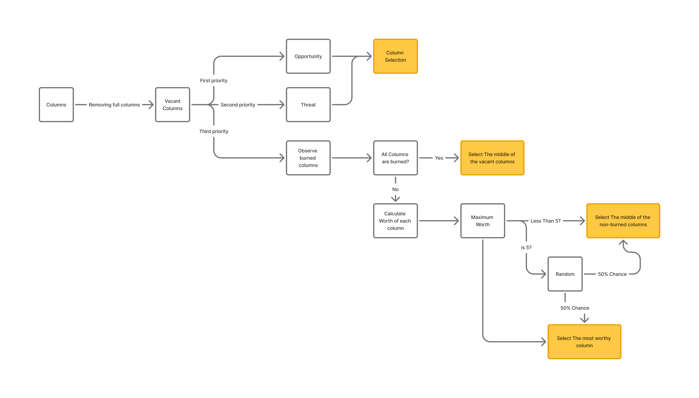

# Connect Four Game - TUI

## AI Smartness & Game Difficulty
Game's AI comes in three difficulty levels, Easy, Medium and Hard.

### Terminology

- **Threat:** When it is your turn and there exists a column in which if your opponent puts their token in they will win immediately. **Blocking a threat** is defined as putting your token at this column to prevent their winning. Threats can be diagonal, horizontal or vertical, depending how your opponent wins if they put their token in that column. If they shape a vertical sequence of four by putting their token, it is a vertical win for them and hence that column shows a vertical threat. Same goes for horizontal win/threat and diagonal.

- **Opportunity:** If it is your turn and there exists a column in which if you put your token you will win immediately, you have an 'Opportunity'.

- **Dominated Column**: For a non-empty column, the token that is placed in the top most place, determines who has currently dominated this column. If the top most token is player 1's token, the column is currently dominated by player 1, and vice versa.

- **Combo**: If a column is dominated by a player, the number of consecutive tokens of that player that are placed on the top of the column, determine the *Combo* number of that column.

- **Burned Column:** if there exists a column in which the number *Column's Combo + Number of free places in the column* is less than 4, no one can make a vertical win in this column, hence it is considered as a *Burned Column*.

### Easy Difficulty

The implementation is done at the function *aiMoveEasy* located at `main.c`. This function is of the type MoveFn and recognized as the decision function for AI player by the engine. This means the engine runs this function, gives it the information it needs, the the function makes the decision of where to put the next token, and returns the selected column index($0 <= x < C$).

At the easy level, game's AI makes random decisions most of the time. The AI first determines which columns are vacant so it can put its token in. Then the AI has 20% chance to see if it has an 'opportunity' and take it. If it does not see any opportunities, it looks for threats. The AI at easy level has a 30% chance to see a threat and block it. If it neither sees a threat or opportunity, it chooses one of the vacant columns randomly.

### Medium Difficulty

At the medium level, the AI determines the vacant columns(the columns it can play in) and will see all 'opportunities' and 'threats'. If an opportunity is seen the AI will take it immediately, otherwise if there exists a threat, it will be blocked immediately. If neither an opportunity or threat exists, AI determines the columns that are not burned columns, then rates them based on this logic:

- *For the place in the column which my token lands in, I look at its 8 neighbors. For each neighbor, if they are empty, it adds one point for this column, if it hosts my token, it adds 3 points and if it hosts my opponent's token, it adds 2 points.*

The number of points each column gets determines how worthy it is to be played. AI selects the column that has the maximum-worth. If there are multiple columns satisfying that condition, the leftmost column is chosen. This makes AI prioritize putting its token beside its own tokens at the first place, and beside its opponent's tokens at the second place. This increases the chance to build networks that either result in an opportunity or prevent the generation of threats from the opponent.

If the maximum-worth is less than or equal to 4, it means all the places in which its token will land, are surrounded by nothing. If this is the case, the AI will select the middle of the worthy columns.

else, If the maximum-worth is less than or equal to 5, it means all the places in which its token will land, are either surrounded by nothing, or they are surrounded by only one of its opponent token. If this is the case, 50% of the times the AI will select the middle of the worthy columns, and 50% of the times it will select the most worthy column.

If all columns are considered as burned columns, AI will select the middle of the vacant columns.

*Graph of decision for medium difficulty game AI*

## Implementation Details

### Board
A 12x12 2D array is used to store the board information, The values R & C which the user defines, determine the boundary of this array which we will be working with. A value 0 in this array represents a vacant place, a value of 1 means a token of the player1 which has the id of 1 is placed there, and a value of 2 represents player 2's token. Player 1 & 2 can be either human, AI, or even an input file which determines the moves, what matters is the token.

### Token Customization
The token for both players can be determined by user, and it can be any character. The game will not break because the game stores the board as an integer 2D array in which the values correspond to player's id which is a constant determined by the game that can not be changed or customized, hence regardless of the token that is chosen, the game can properly determine where the tokens of each player are placed. The game only looks at the user provided character token when it wants to print the board . At other parts, the choice of the character for token does not change any functionality and have no effect.

### User Independent Engine
The engine simulates the lifecycle of the program and is provided with event handlers. The engine is not hard coded to look at the settings and behave respectively, instead, it is told what to do on each event. If the game ends, it runs the function that handles this event, if the game continues, it runs the corresponding event handler which it was provided. We do not tell the engine what to do for each setting or gamemode, we give it functions and event handlers to run in different outcomes, and we give it different functions and event handlers based on what gamemode or settings we have. This helps to keep the logic of the engine simple and have a modular, function based, event handler based code while providing a customizable setting and gamemode.

The engine function lifecycle is as below:
- Receive the parameters, such as the current configuration of the board(it can be any configuration, meaning you can start the game at different starting points, but it needs to be player one's turn, and the board should not be full)
- Run the move functions of the player whos turn is right now to receive their selection.
- Try to put their token at the selected columns, if failure, run the wrongColumnHandler to get the new selected column, and continue this until you are given a valid selected column.
- Now that the token is placed, this column selection is saved in an array to be used in case you choose the save the game's replay at the end. The engine will run the checkWin function to check if the game has ended, If ended, it will run the end-handler function, and break out of the loop, and if not, it will call the continue-handler function.
- Repeat this for the other player
- Repeat the process again until the game ends.